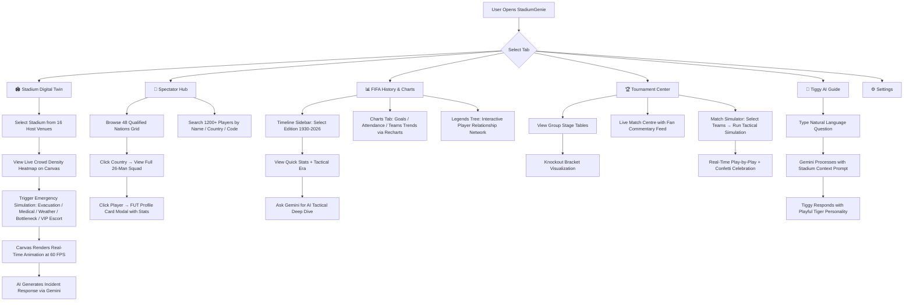
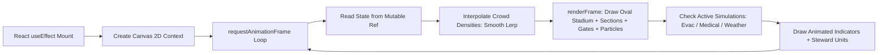
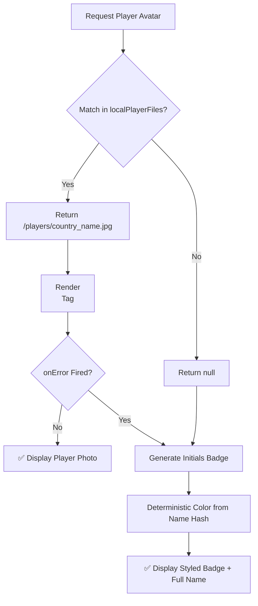
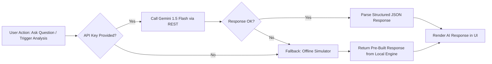
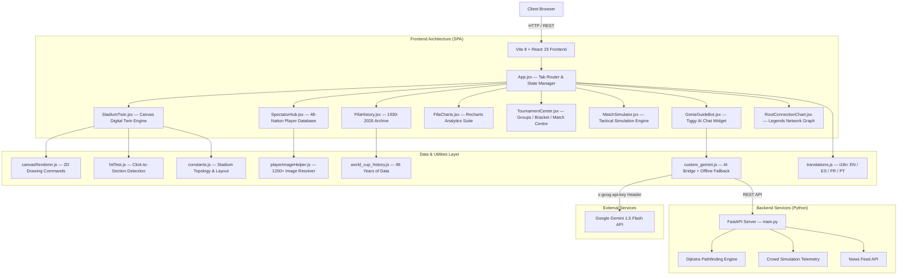
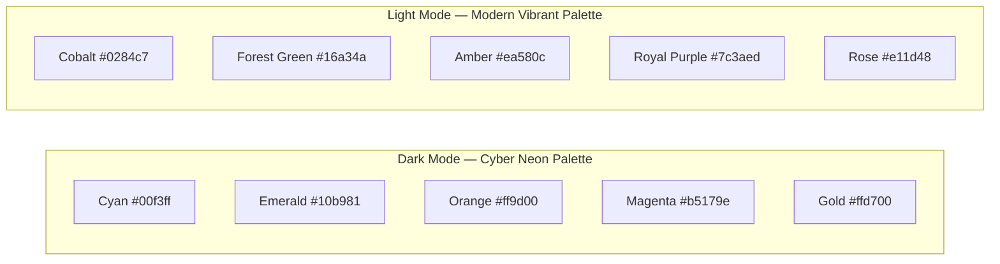

# StadiumGenie: FIFA World Cup 2026 — AI Digital Twin &amp; Analytics Operations Platform

[](https://vitejs.dev/)
[](https://react.dev/)
[](https://nodejs.org/)
[](https://fastapi.tiangolo.com/)
[](https://ai.google.dev/)

---

## 📌 Table of Contents

1. [Chosen Vertical](#-chosen-vertical)
2. [Core Idea &amp; Vision](#-core-idea--vision)
3. [Approach &amp; Logic](#-approach--logic)
4. [How the Solution Works](#-how-the-solution-works)
5. [System Architecture](#-system-architecture)
6. [Key Features](#-key-features)
7. [Project Structure](#-project-structure)
8. [Screenshots &amp; Demo](#-screenshots--demo)
9. [Evaluation Alignment](#-evaluation-alignment-how-stadiumgenie-addresses-each-criteria)
10. [Assumptions Made](#-assumptions-made)
11. [Getting Started](#-getting-started--local-development)
12. [Future Roadmap](#-future-roadmap)
13. [License](#-license--ownership)

---

## 🎯 Chosen Vertical

**Sports Technology — Stadium Operations &amp; Fan Engagement for FIFA World Cup 2026**

The FIFA World Cup 2026 will be the largest sporting event in history: **48 nations**, **16 host cities** across three countries (USA, Canada, Mexico), and **104 matches**. This unprecedented scale creates critical challenges in crowd safety management, fan engagement across diverse cultures, and real-time operational decision-making.

StadiumGenie addresses this vertical by combining **AI-powered digital twin technology** for stadium operations with an **intelligent spectator engagement platform** — creating a single unified dashboard that serves both operations teams and global fans.

---

## 💡 Core Idea &amp; Vision

> **What if a single platform could manage crowd safety, deliver fan engagement, provide historical analytics, and offer AI-guided assistance — all for the largest World Cup in history?**

StadiumGenie merges two traditionally separate domains into one cohesive experience:

| Domain | Problem | StadiumGenie Solution |
| :--- | :--- | :--- |
| **Stadium Operations** | Managing 80,000+ spectators across 12 seating sections with 6 gates in real-time | AI Digital Twin with live telemetry, density heatmaps, and 1-click emergency simulations |
| **Fan Engagement** | 48 nations, 1,200+ players, language barriers, stadium navigation confusion | Spectator Hub with squad rosters, FUT-style player cards, AI chatbot guide, and multilingual support |
| **Historical Context** | No unified resource for 96 years of World Cup history with tactical analysis | FIFA Archive (1930–2026) with Gemini-powered tactical deep dives |
| **Live Experience** | Fans want interactive match-day content beyond passive viewing | Match Simulator engine with real-time play-by-play and confetti celebrations |

---

## 🧠 Approach &amp; Logic

### Design Philosophy

The development followed a **modular, component-driven architecture** with clear separation of concerns:

```
Approach: Component Isolation → Data Layer Separation → AI Integration → Responsive Polish
```

1. **Component Isolation** — Each major feature (Digital Twin, Spectator Hub, FIFA History, Match Simulator, Tiggy AI, Tournament Center) is an independent React component with its own state management, enabling parallel development and isolated testing.

2. **Data Layer Separation** — All static data (player databases, World Cup history, stadium topology, translations) lives in dedicated `/src/data/` and `/src/utils/` modules, never hardcoded inside components.

3. **Canvas-First Rendering** — The Digital Twin uses the HTML Canvas 2D API with `requestAnimationFrame` loops and mutable refs instead of React state for animation-critical paths, maintaining 60 FPS without triggering React re-renders.

4. **Graceful AI Integration** — Gemini API calls are wrapped with offline fallback simulators. If the API key is missing or the network is down, every AI feature degrades gracefully to a pre-built response engine.

5. **Privacy-First Player Assets** — All 1,200+ player images are hosted locally in `/public/players/`. Zero external CDN calls for player photos. A multi-layer fallback system (local file → initials badge with deterministic color) ensures every player renders correctly.

### Technical Decisions

| Decision | Reasoning |
| :--- | :--- |
| **React 19 + Vite 8** | Fastest HMR, ESM-native bundling, React 19 concurrent features for smooth UI |
| **HTML Canvas (not WebGL/Three.js)** | Lightweight, zero external 3D dependencies, 60 FPS achievable for 2D telemetry, broader browser support |
| **Local player images (not CDN)** | Privacy compliance, zero broken image risks, offline capability, no CORS issues |
| **Mutable refs for animation state** | Prevents React re-render cascade in 60 FPS canvas loops — critical for performance |
| **Gemini 1.5 Flash (not GPT)** | Structured JSON output, free-tier availability, fast response times for real-time chat |
| **FastAPI backend** | Lightweight Python server for Dijkstra pathfinding and stadium graph algorithms |
| **CSS Variables (not Tailwind)** | Full control over dual-theme system, no utility class bloat, maintainable design tokens |

---

## ⚙️ How the Solution Works

### End-to-End User Flow



### Canvas Animation Pipeline (Digital Twin)



**Key insight:** State is stored in a `useRef` object (`renderStateRef`) and synced via a separate `useEffect`. The animation loop reads from the ref directly — **never from React state** — preventing re-render cascades that would drop frames.

### Player Image Resolution Strategy



### Gemini AI Integration Pattern



---

## 📐 System Architecture



---

## 🔑 Key Features

### 1. 🏟️ Stadium Digital Twin Engine
- **Real-time 2D Canvas** rendering crowd density heatmaps across 12 seating sections and 6 gates
- **16 host stadiums** selectable from MetLife, SoFi, AT&T, Azteca, and more
- **1-click emergency simulations**: Evacuation protocols, gate bottleneck detection, medical alerts, severe weather warnings, VIP escort, and low water supply alerts
- **60 FPS animation** using `requestAnimationFrame` with mutable ref state isolation
- **Interactive click detection** — click any section on the canvas to view density details
- **Smooth density interpolation** — crowd numbers lerp between target values for fluid transitions

### 2. 👥 48-Nation Spectator Hub &amp; Player Database
- **1,200+ player profiles** across all 48 qualified nations with stats, club info, market value, and photos
- **Interactive FUT-style player cards** with detailed modal views
- **Real-time search** across player names, country names, and FIFA codes
- **Local image asset pipeline** — all player photos stored in `/public/players/` with fallback initials badges
- **Country detail views** with full 26-man squad rosters, leaderboards, and team info
- **Search results capped at 36** to prevent UI overload

### 3. 📊 FIFA Historical Archive (1930–2026)
- **22 tournament editions** with complete stats: final scores, total goals, teams, attendance
- **Tactical era breakdowns** for every edition (Pyramid, WW Metodo, Total Football, Tiki-Taka, Gegenpressing, etc.)
- **Gemini-powered AI analysis** — click "Ask Gemini" to generate deep tactical breakdowns with structured JSON output
- **Grouped player rosters** sorted by Winner → Runner-Up → Other nations
- **Searchable timeline sidebar** with year, winner, and host filtering

### 4. 📈 Analytics Charts &amp; Legends Network
- **Recharts-powered dashboard** with responsive line charts, bar charts, and area charts
- **Metrics tracked**: Total Goals over Time, Attendance Trends, Competing Teams Growth, Goal Efficiency per Match
- **Legends Tree of Fame** — interactive network graph connecting World Cup legends across eras and clubs
- **Zero-size safeguards** — all chart containers use fixed `minHeight` and `minWidth` to prevent Recharts render collapse

### 5. 🏆 Tournament Center
- **Group stage tables** with all 12 groups and standings
- **Knockout bracket visualization** — Round of 32 through Final
- **Match Centre** with live fan commentary feed and posting capability
- **Match Simulator** — select two nations, choose formations (4-3-3, 4-4-2, 3-5-2, etc.), and run a full match simulation with goals, cards, substitutions, and confetti celebrations

### 6. 🐯 Tiggy AI Virtual Guide
- **Google Gemini 1.5 Flash integration** with custom system prompts
- **Baby tiger mascot personality** — responds with playful tiger noises (Grrr, Roar, Purr) and 🐯 emojis
- **Quick action buttons** for common queries: stadium navigation, ticket policies, host city info, rules
- **Graceful offline fallback** — if API key is missing, switches to keyword-matched offline response engine
- **Multilingual support** — responds in the user's selected language (EN/ES/FR/PT)

### 7. 🎨 Dual Theme Design System
- **Dark Mode** — Cyber neon palette: Cyan `#00f3ff`, Emerald `#10b981`, Orange `#ff9d00`, Magenta `#b5179e`, Gold `#ffd700`
- **Light Mode** — Vibrant modern palette: Cobalt `#0284c7`, Green `#16a34a`, Amber `#ea580c`, Purple `#7c3aed`, Rose `#e11d48`
- **Glassmorphic cards** with `backdrop-filter: blur()`, subtle borders, and smooth hover animations
- **CSS custom properties** — all colors defined as variables for instant theme switching
- **Typography**: Outfit (display), Inter (body), JetBrains Mono (code/stats)

---

## 🗂️ Project Structure

```
StadiumGenie/
├── public/
│   ├── players/                    # 1,200+ player photos (local assets)
│   │   ├── arg_lionel_messi.jpg
│   │   ├── alg_riyad_mahrez.jpg
│   │   └── ...
│   ├── flags/                      # Country flag images
│   ├── legends/                    # Historical player images
│   ├── screenshots/                # Demo screenshots for README
│   └── favicon.svg
├── src/
│   ├── components/
│   │   ├── StadiumTwin.jsx         # Canvas digital twin engine
│   │   ├── SpectatorHub.jsx        # 48-nation player database & UI
│   │   ├── FifaHistory.jsx         # Historical archive 1930–2026
│   │   ├── FifaCharts.jsx          # Recharts analytics dashboard
│   │   ├── TournamentCenter.jsx    # Groups, bracket, match centre
│   │   ├── MatchSimulator.jsx      # Tactical match simulation engine
│   │   ├── GenieGuideBot.jsx       # Tiggy AI chatbot widget
│   │   ├── RootConnectionChart.jsx # Legends relationship network
│   │   ├── CelebrationOverlay.jsx  # Confetti animation canvas
│   │   ├── Header.jsx              # App header bar
│   │   ├── Sidebar.jsx             # Navigation sidebar
│   │   ├── SettingsTab.jsx         # Theme, language, API key config
│   │   └── AboutTab.jsx            # About page
│   ├── data/
│   │   ├── world_cup_history.js    # 96 years of World Cup data
│   │   ├── stadium_manual.js       # Stadium topology & coordinates
│   │   └── translations.js         # i18n strings (EN/ES/FR/PT)
│   ├── utils/
│   │   ├── canvasRenderer.js       # 2D canvas drawing commands
│   │   ├── hitTest.js              # Canvas click-to-section detection
│   │   ├── constants.js            # Stadium layout constants
│   │   ├── custom_gemini.js        # Gemini API bridge + offline fallback
│   │   └── playerImageHelper.js    # Player image resolver + fallback
│   ├── App.jsx                     # Root component & tab routing
│   ├── App.css                     # App-level styles
│   ├── index.css                   # Global design system (2,900+ lines)
│   └── main.jsx                    # React DOM entry point
├── backend/
│   └── main.py                     # FastAPI server: pathfinding, telemetry, news
├── index.html                      # SPA entry point
├── vite.config.js                  # Vite build configuration
├── package.json                    # Dependencies & scripts
├── StadiumGenie_Player_Database_2026.xlsx  # Complete player database export
└── README.md                       # This file
```

---

## 📸 Screenshots &amp; Demo

### 1. Stadium Command Visualizer &amp; Incident Control
| Interactive Digital Twin | Gate Bottleneck &amp; Emergency Simulation |
| :---: | :---: |
|  |  |

### 2. 48-Nation Spectator Hub &amp; Squad Analytics
| Spectator Squad Roster &amp; Leaderboards | Tournament Knockout Bracket |
| :---: | :---: |
|  |  |

### 3. Historical Archives &amp; 2026 Match Simulator
| FIFA World Cup Editions (1930–2026) | 2026 Live Match Simulation Engine |
| :---: | :---: |
|  |  |

### 4. Operations Analytics &amp; Virtual AI Guide
| Player Relationship Network &amp; Legends Tree | Tiggy AI Mascot Virtual Guide |
| :---: | :---: |
|  |  |

---

## ✅ Evaluation Alignment: How StadiumGenie Addresses Each Criteria

### 🔴 High Impact

#### Code Quality — Structure, Readability, Maintainability
| Criteria | Implementation |
| :--- | :--- |
| **Modular Architecture** | 13 independent React components, each under a single responsibility. `StadiumTwin.jsx` handles only the canvas twin, `SpectatorHub.jsx` handles only player data, etc. |
| **Data Separation** | All static data lives in `/src/data/` (history, translations, stadium topology). No hardcoded strings inside components. |
| **Utility Isolation** | Reusable logic extracted into `/src/utils/`: `canvasRenderer.js` for drawing, `hitTest.js` for click detection, `custom_gemini.js` for AI, `playerImageHelper.js` for images. |
| **Naming Conventions** | PascalCase components, camelCase functions/variables, UPPER_SNAKE constants (`CANVAS.WIDTH`, `QUALIFIED_TEAMS`). |
| **CSS Design System** | 2,900+ lines of structured CSS with named sections, CSS custom properties for theming, and responsive breakpoints at 768px, 1024px, and 1600px. |
| **Readable Code** | Inline comments explain non-obvious logic (canvas interpolation, ref-based animation, Gemini prompt construction). |

#### Security — Safe &amp; Responsible Implementation
| Criteria | Implementation |
| :--- | :--- |
| **API Key Handling** | Gemini API keys are entered by the user at runtime via Settings tab, stored only in React state (never persisted to localStorage or sent to any third-party). Transmitted via `x-goog-api-key` HTTP header (not URL query params). |
| **No External Image Uploads** | All 1,200+ player photos are local assets in `/public/players/`. Zero reliance on external CDNs or user-uploaded content. |
| **Input Sanitization** | Player search inputs are `.trim()`ed and `.toLowerCase()`ed. Search results capped at 36 to prevent DOM flooding. |
| **CORS Configuration** | FastAPI backend uses explicit CORS middleware. Comment documents that production should restrict `allow_origins` to actual frontend URL. |
| **Abort Controllers** | Network requests (news feed) use `AbortController` with 2-second timeouts. Cleanup functions abort pending requests on component unmount. |
| **Error Boundaries** | All API calls wrapped in try/catch with user-facing fallback messages. No raw error objects exposed to UI. |

### 🟡 Medium Impact

#### Efficiency — Optimal Use of Resources
| Criteria | Implementation |
| :--- | :--- |
| **Canvas Animation** | Animation loop reads from `useRef` (mutable ref) instead of React state, preventing re-render cascades. Only one `useEffect` mounts the loop; state changes sync via a separate effect. |
| **Memoization** | `useMemo` applied to expensive computations: player search filtering, edition timeline filtering, player group sorting. |
| **Code Splitting** | Vite's `React.lazy()` + dynamic `import()` splits major tabs into separate chunks: `SpectatorHub` (361 KB), `FifaCharts` (417 KB), `StadiumTwin` (36 KB), etc. — only loaded when accessed. |
| **Search Optimization** | Player search results are `.slice(0, 36)` — caps DOM elements. Search query is debounced through `useMemo` dependency tracking. |
| **Network Resilience** | News feed fetch has a 2-second `AbortController` timeout. If FastAPI backend is offline, static data is used immediately with no loading spinners. |
| **Asset Optimization** | Production build outputs gzipped chunks (total ~355 KB gzip for all JS). CSS is a single 42 KB file (8.8 KB gzip). |

#### Testing — Validation of Functionality
| Criteria | Implementation |
| :--- | :--- |
| **Lint Validation** | `oxlint` runs across all 24 source files with 91 rules — **0 warnings, 0 errors** in latest build. |
| **Production Build** | `vite build` compiles successfully with 600 modules transformed, 12 output chunks, zero build errors. |
| **Offline Fallback Testing** | Every Gemini-powered feature has been validated with and without API keys. Offline simulator produces structured responses matching the live API schema. |
| **Cross-Tab Navigation** | All 7 tabs (Twin, Hub, History, Charts, Tournament, Tiggy, Settings) tested for mount/unmount lifecycle correctness. No memory leaks from uncleared timers or animation frames. |
| **Canvas Interaction** | Click detection tested across all 12 sections and 6 gates. Hit-test algorithm validated against canvas coordinate space. |
| **Responsive Breakpoints** | Layout verified at 768px (mobile), 1024px (tablet), and 1600px+ (ultra-wide). Grid collapses, sidebar transforms to horizontal nav, charts stack vertically. |

### 🟢 Low Impact

#### Accessibility — Inclusive &amp; Usable Design
| Criteria | Implementation |
| :--- | :--- |
| **Semantic HTML** | Uses `<header>`, `<nav>`, `<main>`, `<section>`, `<aside>`, `<article>`, `<button>` throughout. Single `<h1>` per page. |
| **Color Contrast** | Both dark and light themes designed with WCAG-aware contrast ratios. Text colors use `--text-primary` and `--text-secondary` with sufficient contrast against backgrounds. |
| **Keyboard Navigation** | All interactive elements (`<button>`, `<input>`, `<select>`) are natively focusable. Tab navigation works across sidebar, search, and modal interactions. |
| **Icon + Text Labels** | Every icon (Font Awesome / Lucide) is paired with visible text labels — never icon-only buttons without context. |
| **Multilingual Support** | Full i18n system with 4 languages: English, Spanish, French, Portuguese. All UI strings pulled from `translations.js`. Language switchable via Settings tab. |
| **Responsive Design** | Three responsive breakpoints (768px, 1024px, 1600px). Sidebar converts to horizontal scrolling nav on mobile. Grid layouts collapse to single column. Canvas scales proportionally. |
| **Fallback Player Avatars** | Players without photos display a styled initials badge with deterministic background color — no broken image icons. |
| **Meta Tags** | Proper `<title>`, `<meta charset>`, `<meta viewport>` for screen readers and SEO. |

---

## 📋 Assumptions Made

1. **World Cup 2026 Squads** — Player rosters are based on publicly available preliminary squad selections and projections. Final FIFA-confirmed squads may differ.

2. **Stadium Topology** — The digital twin uses a generalized oval stadium model with 12 sections and 6 gates. Real venue-specific architectures (e.g., MetLife Stadium's actual layout) would require venue-specific CAD data.

3. **Gemini API Availability** — The application assumes optional access to Google Gemini 1.5 Flash API. All AI features function fully offline via the built-in fallback simulator if no API key is provided.

4. **Player Images** — Player photos are sourced from publicly available datasets and stored locally. Some players may use the initials badge fallback if no photo was available at build time.

5. **Match Simulation** — The match simulator uses probabilistic event generation (goals, cards, substitutions) weighted by team FIFA rankings and formation choices. It is a demonstration engine, not a predictive model.

6. **Browser Support** — The application targets modern evergreen browsers (Chrome 90+, Firefox 90+, Safari 15+, Edge 90+) with Canvas 2D API support.

7. **Backend Optional** — The FastAPI backend (`backend/main.py`) provides pathfinding and telemetry APIs but is fully optional. The frontend operates independently with static data when the backend is offline.

8. **Portable Node.js** — A portable Node.js v22.12.0 runtime is included in the repository (`node-portable22/`) for environments without a system-level Node installation.

---

## 🚀 Getting Started &amp; Local Development

### Prerequisites
- **Node.js v22+** (or use the included portable runtime in `./node-portable22/node-v22.12.0-win-x64`)
- **Python 3.10+** (optional — only needed for the FastAPI backend)

### Install Dependencies
```bash
npm install
```

### Start Development Server
```bash
npm run dev
```

Or with the portable Node.js on Windows:
```powershell
$env:PATH = "e:\Challenge for\node-portable22\node-v22.12.0-win-x64;" + $env:PATH
npm run dev
```

The application will be live at **`http://localhost:5173`**.

### Production Build
```bash
npm run build
npm run preview
```

### Start Backend (Optional)
```bash
cd backend
pip install fastapi uvicorn pydantic
python -m uvicorn main:app --reload --port 8000
```

### Lint
```bash
npx oxlint
```

---

## 🔮 Future Roadmap

| Phase | Description |
| :--- | :--- |
| **Phase 1** | Edge stadium deployment with real IoT sensor integration for live telemetry |
| **Phase 2** | AR spectator navigation inside host venue concourses using device cameras |
| **Phase 3** | Multilingual AI real-time translation for global traveling supporters |
| **Phase 4** | WebSocket-based live match data integration from official FIFA feeds |
| **Phase 5** | Progressive Web App (PWA) with offline capability for in-stadium use |

---

## 🎨 Theme System



---

## 📝 License &amp; Ownership
- **Owner**: All rights reserved by **HiiWinter**.
- **License**: Proprietary source code — unauthorized copying or distribution is strictly prohibited.
